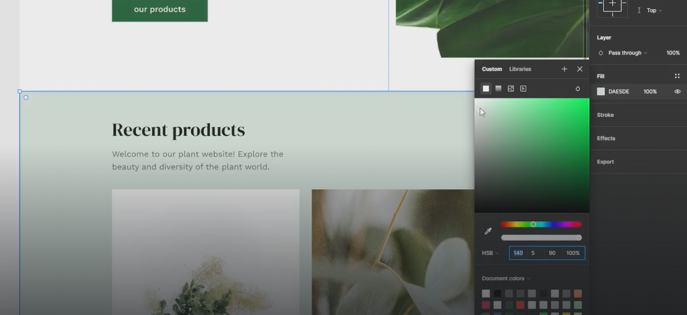
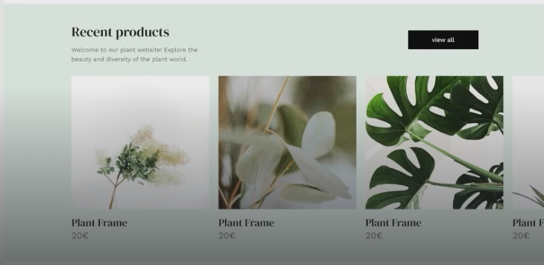
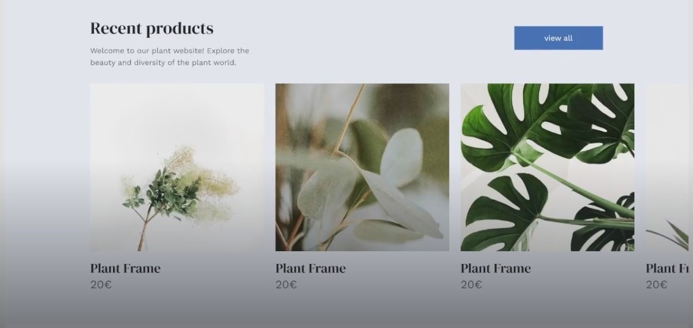
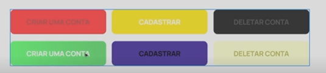
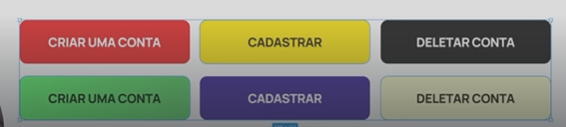

# Colours

## Background

- on the second sections is always good to use the CTA button color in a very light way mixtured with gray

- with blue

## Colour contrast

- It's difference between colours
- The more the contrast, the more people will understand the content.

- common errors

-How to fix these errors

- [Colour contrast checker website](https://coolors.co/contrast-checker/112a46-acc8e5)

## Colours Hhierarchy

- Method 60 - 30 - 10
    - 60% main colour
    - 30% secondary colour
        - for cards?
        - for sections
        - can vary or have two options
    - 10% Hightligh colour
        - brand colour, use to highligh elements
        - for CTA 
        - for img backgrounds
        - to highlight a phrase or words
    - Extra Colors:
        - Extra colors like shades of gray can be use sometimes

- 60% Purple
- 30% White
- 10% Black?

## Inspiration

[Online Palette](https://www.onlinepalette.com/)