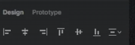

# Grid/Layouts

## Spacing 

- Do not use loads of different spacing numbers

- Spacing is divided in 4x parts
- using multiples of `8px`

[Law of Proximity](https://lawsofux.com/law-of-proximity/)

## Vertical Alignment

- Always make sure to align elements properly

- Use these tools to  align in relation to the next item

