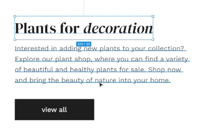

# System Alerts

- Examples like this doesn't work
- red/orange means `error.`

- Red always has be to used to warn the user.

## Black color

- Do not use `100% black colour` or `#000000`

- use a lighter black

