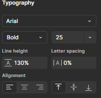
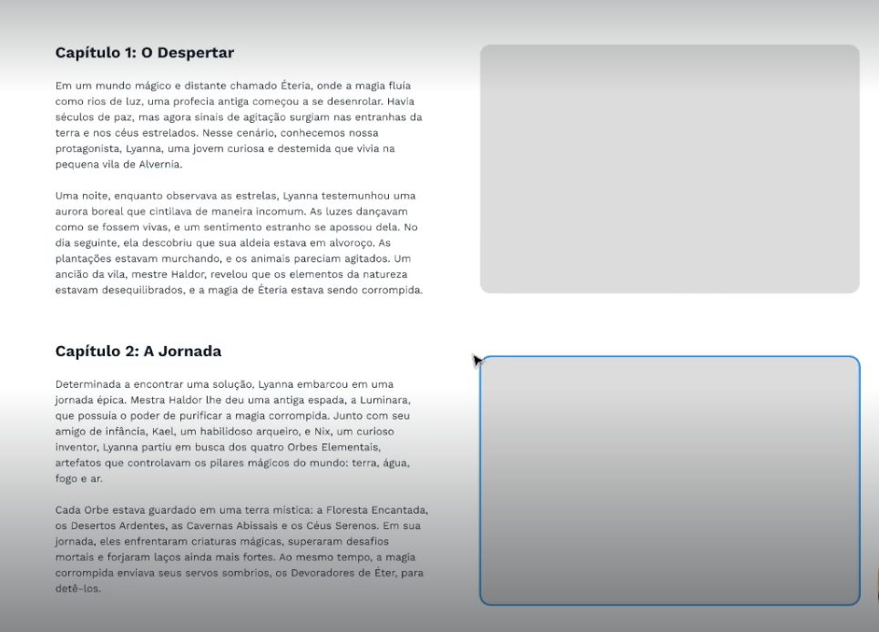
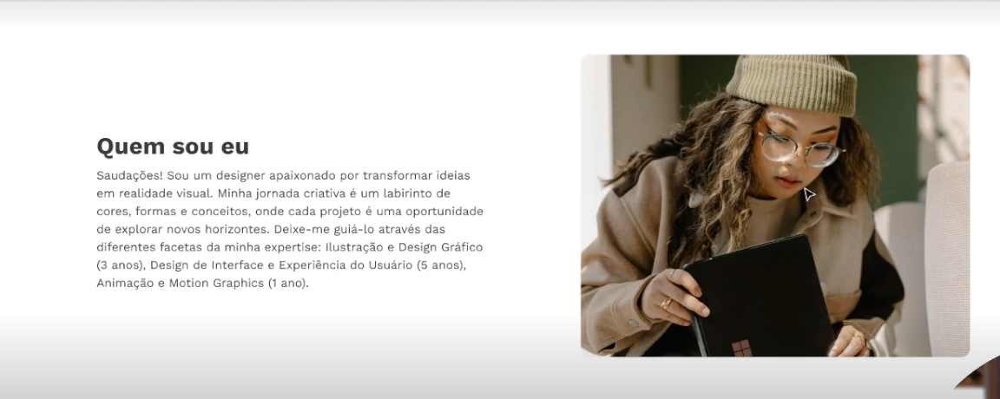

# Line Height

## Ideal Line-height

[The Good Line Height website](https://thegoodlineheight.com/)

- The ideia size is 130% to 150% of the **font size**.

- Do not use `Auto` line height on figma.

## Line

- 60 to 80 caracters per line:

[Quillbot](https://quillbot.com/word-counter) - to count caracters.
- Smaller Grid for the text.

## Text Color

- **In a White background**:
    - Headers : ``Black``
    - p elements : ``grayish``

## Text + Images

- 2 x imgs with text

- Better version
- Simpler topics

- Styling even more with custom icons or **bullet points**

## Uppercase and Lowecase

- **Uppercase**:
     - for shorter text or `call to action btns`
     - For `big Titles`
        - Use less **letter space**
    - for `pre-titles` **with letter space**
- **Lowecase**:
    - For general text

## Letter spacing

- Letter spacing in 0px normally resolve all problems

## Good Fonts

- Work Sans
- Roboto
- Raleway
- Segou UI

